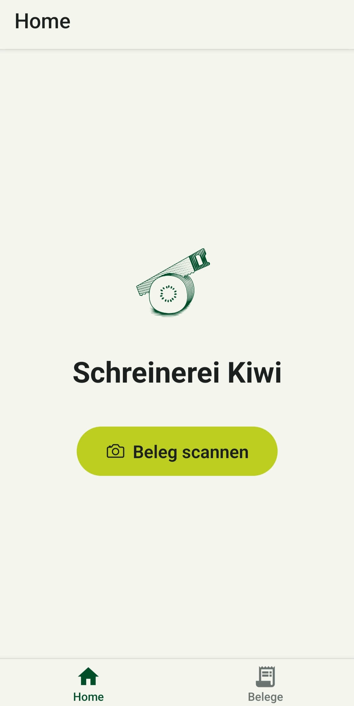
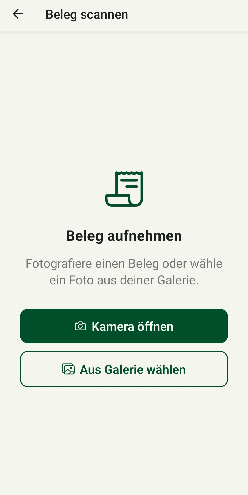
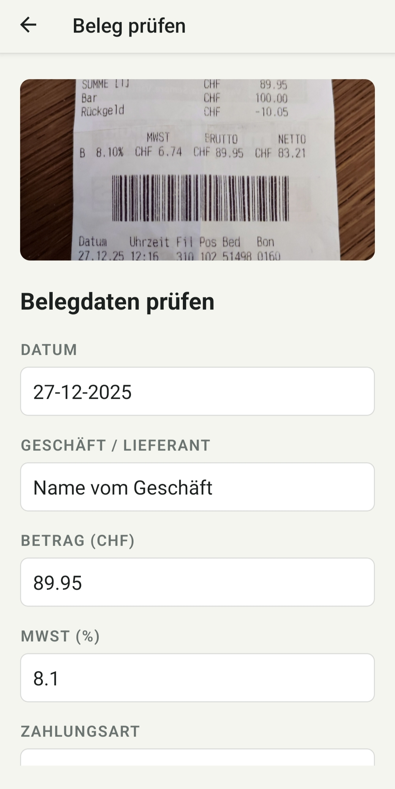
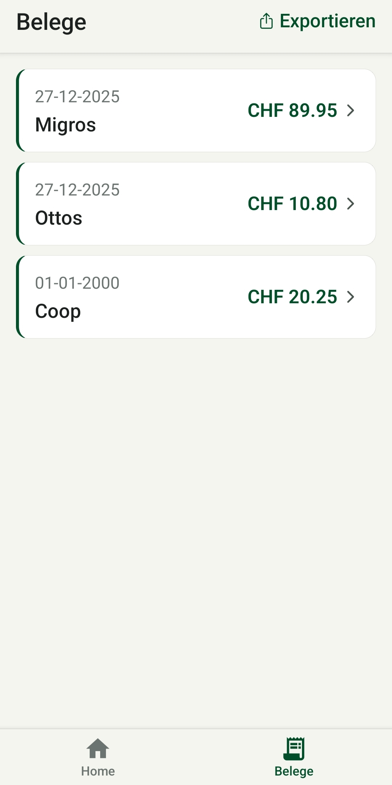

<p align="center">
  
</p>

<h1 align="center">kiwi</h1>

<p align="center">
  Belege fotografieren — Daten automatisch erfassen — Jederzeit exportieren.
</p>

<p align="center">
  
  
  
</p>

---

## Screenshots

<p align="center">
  
  
  
  
</p>

---

## Features

- **Beleg scannen** — Kamera öffnen, Foto aufnehmen, fertig
- **KI-Erkennung** — Datum, Geschäft, Betrag, MwSt und Zahlungsart werden automatisch ausgelesen (Google Gemini)
- **Prüfen & Speichern** — Felder kontrollieren, anpassen, lokal speichern
- **Belegliste** — Alle Belege auf einen Blick, bearbeitbar und löschbar
- **CSV-Export** — Alle Belege als CSV exportieren und per E-Mail, Drive oder WhatsApp teilen

---

## Tech Stack

| Layer | Technologie |
|-------|-------------|
| Framework | React Native + Expo (EAS Build) |
| Navigation | Expo Router |
| Datenbank | SQLite (`expo-sqlite`) |
| KI / OCR | Google Gemini API (`gemini-2.5-flash`) |
| Kamera | `expo-image-picker` |
| Export | `expo-file-system` + `expo-sharing` |

---

## Setup

### Voraussetzungen

- [Node.js](https://nodejs.org) ≥ 18
- [EAS CLI](https://docs.expo.dev/eas/) — `npm install -g eas-cli`
- Google AI Studio API Key — [aistudio.google.com](https://aistudio.google.com)

### Installation

```bash
git clone https://github.com/Schiggy-3000/kiwi.git
cd kiwi
npm install
```

### Umgebungsvariablen

Erstelle eine `.env`-Datei im Projektverzeichnis:

```env
EXPO_PUBLIC_GEMINI_API_KEY=dein_api_key_hier
```

### Entwicklungs-Build starten

```bash
# Build erstellen (einmalig oder bei nativen Änderungen)
eas build --profile development --platform android

# Dev-Server starten
npx expo start --dev-client
```

---

## Datenschutz

Die App überträgt Belegfotos ausschliesslich zur Texterkennung an die Google Gemini API (HTTPS-verschlüsselt). Alle Belegdaten werden lokal auf dem Gerät gespeichert. Keine Konten, kein Tracking, keine Werbung.
